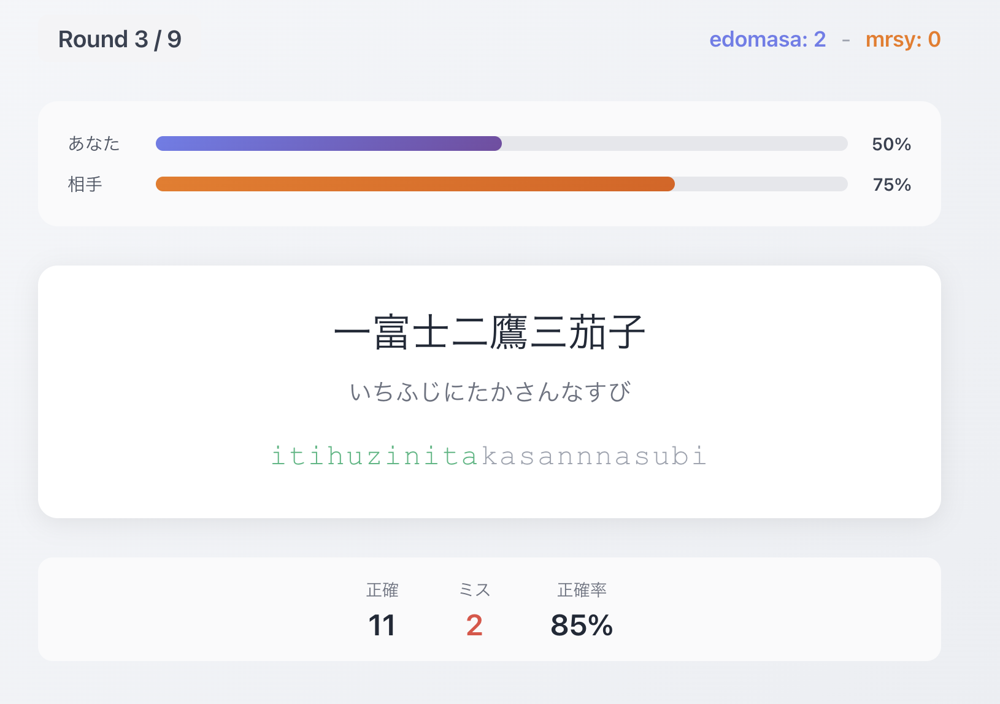

# Vibe Typing ⌨️

友達とリアルタイムで対戦できるタイピングゲームです。同じ問題を同時にタイピングして、速さと正確さで勝負しよう！



## どんなゲーム？

- 2人でリアルタイム対戦（観戦もOK）
- 日本語の文章をローマ字で入力
- `si` でも `shi` でも OK — 複数の入力パターンに対応
- ラウンド制（1/3/5/7/9ラウンドから選べる）
- 効果音付きで気持ちいいタイピング体験

## 問題セット

- **一般** — 日常的な日本語フレーズ
- **プログラミング** — エンジニア向けの用語たち
- **小学生ことわざ・慣用句** — 291問のがっつりセット

問題を追加したい？ `server/data/questions/` に CSV を置くだけ！

```
日本語の文章,にほんごのぶんしょう
```

## セットアップ

Node.js 18 以上が必要です。

```bash
# パッケージインストール
npm run install:all

# 開発モードで起動（サーバー + クライアント）
npm run dev
```

- クライアント: http://localhost:5173
- サーバー: http://localhost:3001

LAN内の別デバイスからもアクセスできるので、同じWi-Fiに繋いで対戦できます。

### 本番ビルド

```bash
npm run build
npm start
```

クライアントがビルドされ、サーバーから静的ファイルとして配信されます。

## 遊び方

1. トップ画面で名前を入力してルームを作成
2. ルームIDを友達にシェア
3. 問題セットとラウンド数を選んで「準備OK」
4. 両方が準備完了したらゲームスタート！
5. 勝った方が先に規定勝利数に達したら勝ち

## 技術スタック

| | |
|---|---|
| フロントエンド | React + TypeScript + Vite |
| バックエンド | Express + Socket.io |
| スタイリング | CSS Modules |
| リアルタイム通信 | Socket.io（WebSocket） |

## ライセンス

[MIT](LICENSE)
